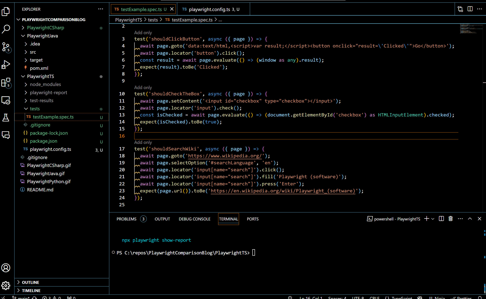
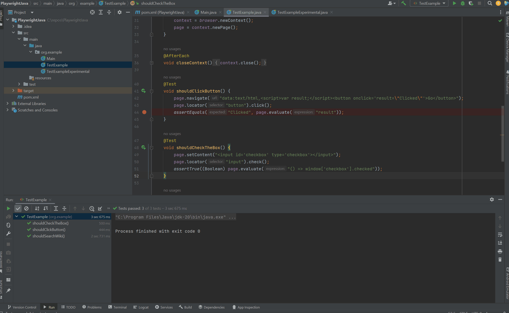
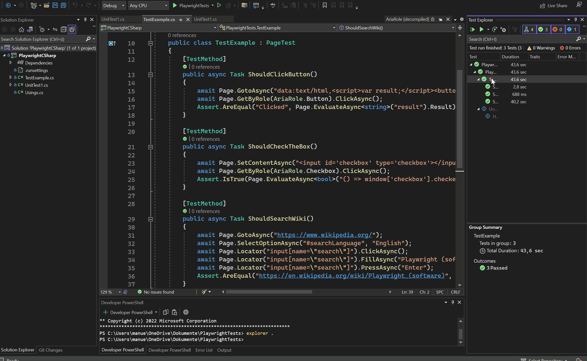
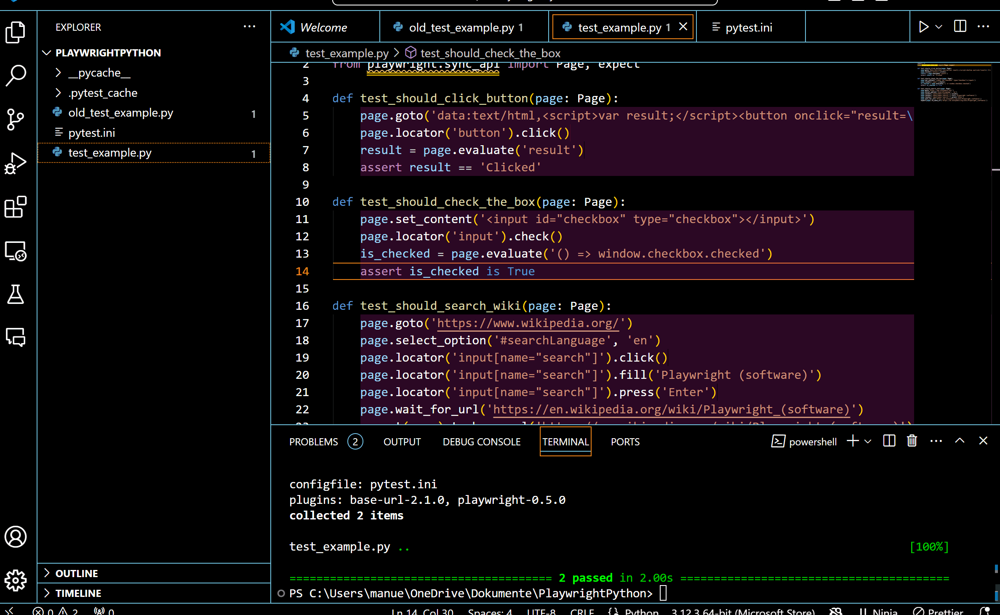

# PlaywrightComparisonBlog

This repository contains examples of the same test suite implemented in multiple programming languages using Playwright. Each variant demonstrates how to achieve the same functionality using Playwright in different languages. This repository was created for a [blog](https://manuelhintermayr.com) that compares these technologies.

## Table of Contents
- [Test Example](#test-example)
- [Usage](#usage)

## Test Example

The test example class, named `TestExample`, demonstrates common web automation scenarios, such as clicking a button, checking a checkbox, and searching on Wikipedia. Each language variant implements the same set of tests using their respective syntax and conventions.

## Usage

To run the tests for each language variant, follow the instructions provided in their respective directories:

- **PlaywrightTS**: TypeScript variant using Playwright TypeScript.
  
  ```bash
  npx playwright test
  ```

- **PlaywrightJava**: Java variant using Playwright Java.
  

- **PlaywrightCSharp**: C# variant using Playwright .NET.
  

- **PlaywrightPython**: Python variant using Playwright Python.
  
  ```bash
  pytest
  ```

Make sure to have the necessary dependencies installed for each language variant before running the tests.